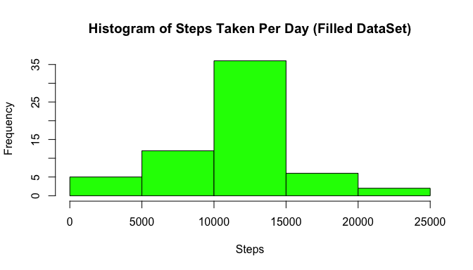

# Reproducible Research: Peer Assessment 1


## Loading and preprocessing the data

Set the working directory and load the data. At this stage, we *ignore* the missing value.

```r
setwd("/Users/wangben/RepData_PeerAssessment1/")
rawData <- read.table("activity.csv", header=TRUE, sep = ",")
actData <- rawData[!is.na(rawData$steps),]  # Ignore the missing value
actData$date <- as.character(actData$date)
str(actData)
```

```
## 'data.frame':	15264 obs. of  3 variables:
##  $ steps   : int  0 0 0 0 0 0 0 0 0 0 ...
##  $ date    : chr  "2012-10-02" "2012-10-02" "2012-10-02" "2012-10-02" ...
##  $ interval: int  0 5 10 15 20 25 30 35 40 45 ...
```

```r
head(actData)
```

```
##     steps       date interval
## 289     0 2012-10-02        0
## 290     0 2012-10-02        5
## 291     0 2012-10-02       10
## 292     0 2012-10-02       15
## 293     0 2012-10-02       20
## 294     0 2012-10-02       25
```

## What is mean total number of steps taken per day?

Calculate and plot the total number of steps taken per day

```r
totalStepsPerDay <- tapply(actData$steps,actData$date,sum)
hist(totalStepsPerDay,
     col=rgb(0,1,0),
     main="Histogram of Steps Taken Per Day",
     xlab="Steps",
     ylab="Frequency")
```

<!-- -->

```r
mn <- mean(totalStepsPerDay)
md <- median(totalStepsPerDay)
```
The mean of total number of steps taken per day is 1.0766189\times 10^{4}.  
The median of total number of steps taken per day is 10765. 

## What is the average daily activity pattern?
Calculate the mean and median of daily steps

```r
meanStepsPerDay <- tapply(actData$steps,actData$date,mean)
medianStepsPerDay <- tapply(actData$steps,actData$date,median)
actDate <- as.Date(dimnames(meanStepsPerDay)[[1]], "%Y-%m-%d")
```

Plot the *mean* steps chart

```r
plot(actDate,meanStepsPerDay, type="l", lwd = 2, col = "blue",
     xlab="Date", ylab="Steps", main="Mean Steps Per Day")
```

<!-- -->

Plot the *median* steps chart

```r
plot(actDate,medianStepsPerDay, type="l", lwd = 2, col = "green",
     xlab="Date", ylab="Steps", main="Median Steps Per Day")
```

<!-- -->

Nextly, we calculate the mean and median steps of each interval


```r
meanStepsPerInv <- tapply(actData$steps,actData$interval,mean)
medianStepsPerInv <- tapply(actData$steps,actData$interval,median)
inv <- levels(factor(actData$interval))
```

Plot the *mean* and *median* steps of each interval

```r
par(mfrow = c(2,1), mar=c(4,4,1,1))
plot(inv, meanStepsPerInv, type="l", lwd = 2, col = "blue",
     xlab="", 
     ylab="Mean Steps of Interval")
plot(inv, medianStepsPerInv, type="l", lwd = 2, col = "green",
     xlab="5-Min Interval", 
     ylab="Median Steps of Interval")
```

<!-- -->

```r
mx_mn <- inv[meanStepsPerInv==max(meanStepsPerInv, na.rm = TRUE)]
mx_md <- inv[medianStepsPerInv==max(medianStepsPerInv, na.rm = TRUE)]
```
The maximum *mean* steps are taken in 835, while the maximum *median* steps are taken in 845.

## Imputing missing values

### Summarize the missing data
Missing values **NA** are presented in the dataset. We start with calculate and report the total number of missing values


```r
na_vec <- rep(0, ncol(rawData))  # initialize the zero

for (j in seq_len(ncol(rawData))){
        na_vec[j] <- sum(is.na(rawData[,j]))
        
}
barplot(na_vec, names.arg = names(rawData), col = rgb(0,1,0,0.5),
        xlab = "Variable in Dataset",
        ylab = "# of NAs",
        main = "Total Number of Missing Values")
```

<!-- -->

### Filling the missing values (using mean of the inv)


```r
filledData <- rawData
na_flag <- is.na(rawData$steps)
for (j  in 1:length(inv)){
        filledData$steps[na_flag & rawData$interval == inv[j]] <- meanStepsPerInv[j]
}
```

### Summary of filled dataset
Now, we are going to make the histogram of **filled dataset**

```r
totalStepsPerDay_Filled <- tapply(filledData$steps,filledData$date,sum)
hist(totalStepsPerDay_Filled,
     col=rgb(0,1,0),
     main="Histogram of Steps Taken Per Day (Filled DataSet)",
     xlab="Steps",
     ylab="Frequency")
```

<!-- -->

```r
mn_filled <- mean(totalStepsPerDay_Filled)
md_filled <- median(totalStepsPerDay_Filled)
```
Mean   (Missing Value): 1.0766189\times 10^{4}  
Mean   (Filled Value) : 1.0766189\times 10^{4}  
Median (Missing Value): 10765  
Median (Filled Value) : 1.0766189\times 10^{4}  
The impact on mean is 0, while the impact on median is -1.1886792.

 
## Are there differences in activity patterns between weekdays and weekends?

Label weekday vs weekend.

```r
filledData$weekdays <- as.character(weekdays(as.Date(filledData$date)))
filledData$weekday_label <- "weekday"
filledData$weekday_label[filledData$weekdays=="Saturday"|filledData$weekdays=="Sunday"] <- "weekend"
```

Calculate the mean steps of interval across all weekday or weekend

```r
library(lattice)
wkdayData <- filledData[filledData$weekday_label=="weekday",]
wkendData <- filledData[filledData$weekday_label=="weekend",]

stepsPerInvWkday <- tapply(wkdayData$steps, wkdayData$interval,mean)
stepsPerInvWkend <- tapply(wkendData$steps, wkendData$interval,mean)

wkData <- data.frame(c(stepsPerInvWkday, stepsPerInvWkend),
                     as.shingle(rep(inv,times=2)),
                     as.factor(rep(c("weekday", "weekend"), each = length(inv))))
names(wkData) <- c("average.steps", "interval", "weekday.label")
```

Plot the *mean* steps of each interval in **weekday** and **weekend**

```r
library(lattice)
xyplot( average.steps~interval| weekday.label,
       data = wkData,
       layout = c(1,2), 
       type = "l")
```

<!-- -->
